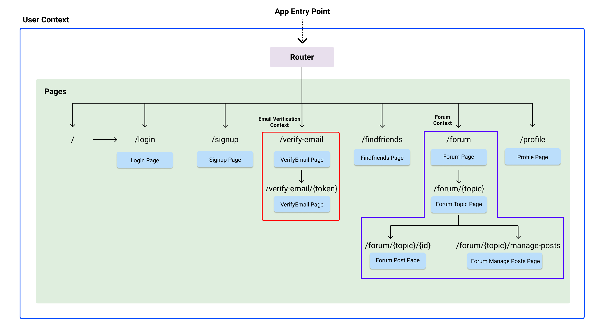
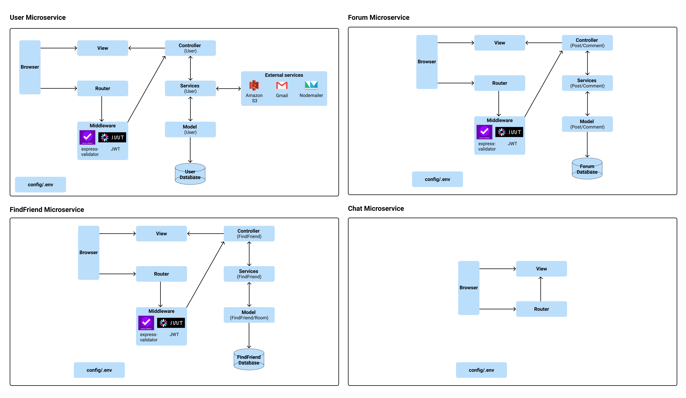
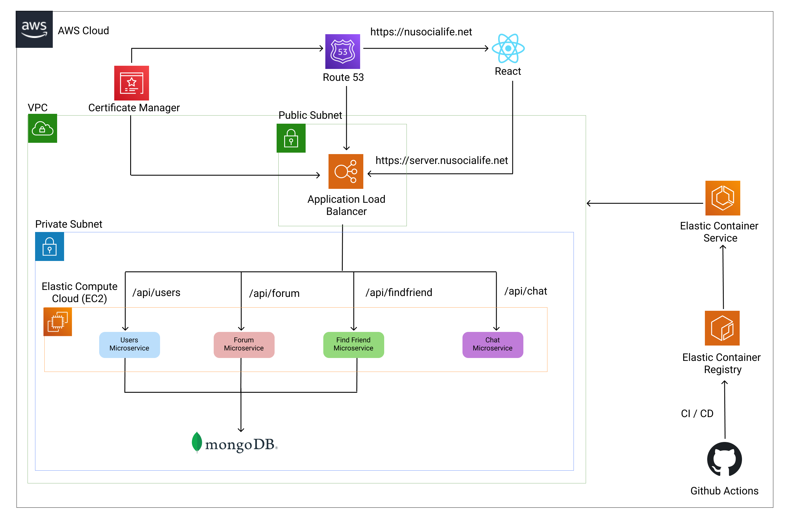

# NUSociaLife

  

## Introduction

NUSociaLife is a social media platform for NUS students to meet new people, giving them the opportunity to find activity groups that they are interested in and to interact with those who share similar interests in a very fun manner.

## Features:

The app consists of 2 main features - Find Friends and Forum. These 2 features allow students to interact with one another on a personal level (Find a Friend) and in a group based setting (Forum).

### Find Friends

Find a Friend allows 1-1 real time communication between 2 students through chat. A student can find a new friend with matching interests and chat in real-time with their newly found friend. To match with a friend, the student can first specify his interests and the matching system will match him with another student of similar interests. Once matched, they will both be invited into a private chat room where they can find more about each other.

### Forum

Forum allows students to interact in a group based setting with other registered users. A student can participate in group interactions through forum discussions. He/she is able to start a new discussion topic by creating a new forum post. He is also able to add on to existing discussion topics by adding comments. In addition, the student can edit or delete posts/comments created by them. Other actions include filtering discussion posts by the list of topics available (shown below) and upvoting/downing a post.

Forum Topics: Academic, Admin, Accomodations, CCA, Tips, Misc

## Architecture

### Overall Architecture

### Frontend Architecture

### Backend Architecture

## Development Process

## DevOps Process

## Instructions for Set Up

### Running Locally

1. Clone the repository
2. Place the required [.env configuration files](https://docs.google.com/document/d/1Kgf9j4RT0TBOU4U45sq1R8ta0S2wVOeZ_JKx1ItLvy4/edit?usp=sharing) in the following directories of:
   - frontend/.env
   - backend/users/.env
   - backend/findfriend/.env
   - backend/forum/.env
   - backend/chat/.env
3. Open a Terminal instance for and start the MongoDB server
   - `mongod --dbpath /usr/local/var/mongodb `
4. Open a Terminal instance for
   Backend microservices deployment:

   - `cd backend`
   - `docker-compose build`
   - `aws configure`
     \*\* Pls contact us via MS Teams to request for AWS credentials
   - Once obtaining credentials, enter the access key id and press ENTER.
   - Next, enter the secret access key and press ENTER.
   - For next 2 options, press ENTER to use default selection.
   - `chmod +x deploy.sh`
   - `./deploy.sh`

5. Open a Terminal instance for Frontend:
   - `cd frontend`
   - `npm install`
   - `npm start`
