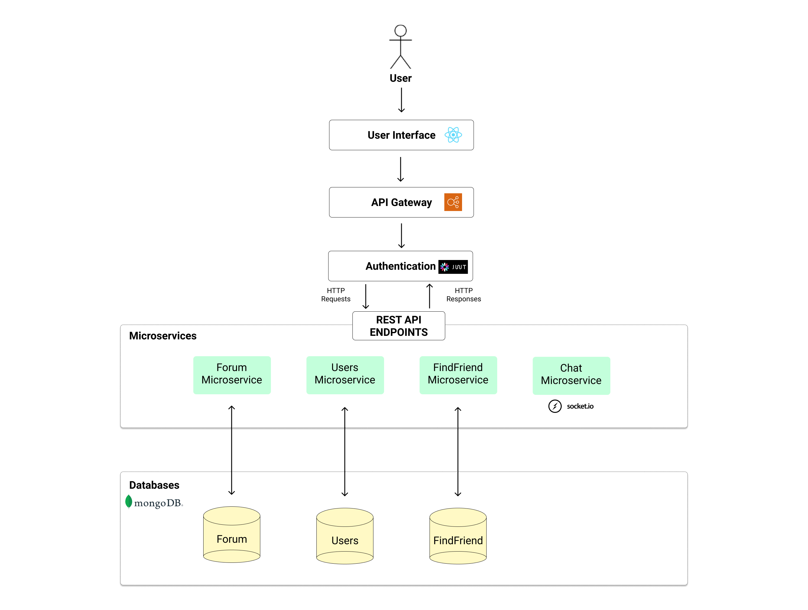
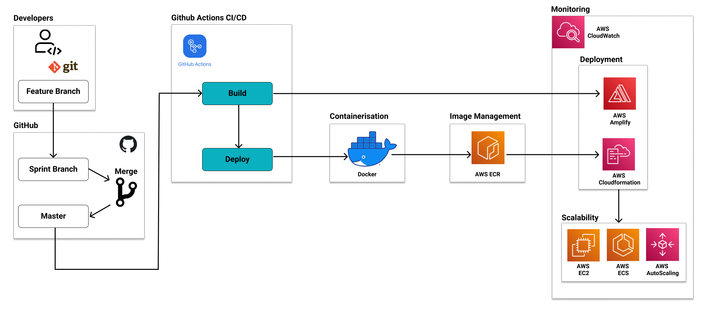

# NUSociaLife

  

## Introduction

NUSociaLife is a social media platform for NUS students to meet new people, giving them the opportunity to find activity groups that they are interested in and to interact with those who share similar interests in a very fun manner.

Website hosted at: [https://www.nusocialife.net/](https://www.nusocialife.net/)

## Features:

The app consists of 2 main features - Find Friends and Forum. These 2 features allow students to interact with one another on a personal level (Find a Friend) and in a group based setting (Forum).

### Find Friend

Find Friends allows 1-1 real time communication between 2 students through chat. A student can find a new friend with matching interests and chat in real-time with their newly found friend. To match with a friend, the student can first specify his interests and the matching system will match him with another student of similar interests. Once matched, they will both be invited into a private chat room where they can find out more about each other.

### Forum

Forum allows students to interact in a group based setting with other registered users. A student can participate in group interactions through forum discussions. He/she is able to start a new discussion topic by creating a new forum post. He is also able to add on to existing discussion topics by adding comments. In addition, the student can edit or delete posts/comments created by them. Other actions include filtering discussion posts by the list of topics available (shown below) and upvoting/downing a post.

Forum Topics: Academic, Admin, Accommodations, CCA, Tips, Misc

## Demo

  

## Architecture

### Overall Architecture

### Frontend Architecture

### Backend Architecture

## Development Process

## DevOps Process

## Instructions for Set Up & Scaling

1.  Clone the repository
2.  Place the required [.env configuration files](https://docs.google.com/document/d/1Kgf9j4RT0TBOU4U45sq1R8ta0S2wVOeZ_JKx1ItLvy4/edit?usp=sharing) in the following directories of:

    - frontend/.env
    - backend/users/.env
    - backend/findfriend/.env
    - backend/forum/.env
    - backend/chat/.env

3.  Install [MongoDB Community Server](https://www.mongodb.com/try/download/community) for MongoDB.

4.  Install [Docker Desktop](https://www.docker.com/products/docker-desktop).

5.  Install [AWS CLI](https://aws.amazon.com/cli/) to view AWS resources.

6.  Install [hey](https://github.com/rakyll/hey) for load testing.

7.  Run Docker Desktop on computer.

8.  Open a Terminal instance for
    Backend microservices deployment:

    - `cd backend`
    - `docker-compose build`
    - `aws configure`
      (\*\* Pls contact us via MS Teams to request for AWS credentials)
    - Once credentials are obtained, enter the access key id and press ENTER.
    - Next, enter the secret access key and press ENTER.
    - For next 2 options, press ENTER to use default selection.
    - `chmod +x deploy.sh`
    - `./deploy.sh`

9.  Open a Terminal instance for Frontend:

    - `cd frontend`
    - `npm install`
    - `npm start`

10. Using the same Terminal from Step 6, we can perform the list of terminal commands:

- List stacks in AWS Cloudformation: `aws cloudformation list-stacks`
- Check a particular stack details: `aws cloudformation describe-stacks --stack-name userMicroservice`

  (userMicroservice is a stack name example here)

- See AWS autoscaling groups for Cluster autoscaling configuration: `aws autoscaling describe-auto-scaling-groups`
- See AWS Application Load Balancer and get ALB Amazon Resource Number (ARN): `aws elbv2 describe-load-balancers`

- To test high availability based on ECS service:

  1. List AWS ECS cluster and get ECS Amazon Resource Number (ARN): `aws ecs list-clusters`
  2. List ECS service: `aws ecs list-services --cluster nusocialife-ECSCluster-uKCGPQtQ1j18`

     (nusocialife-ECSCluster-uKCGPQtQ1j18 is a ECS ARN example here)

  3. List running task (container) by ECS service and get task Amazon Resource Number (ARN): `aws ecs list-tasks --cluster nusocialife-ECSCluster-uKCGPQtQ1j18 --service-name users`

     (nusocialife-ECSCluster-uKCGPQtQ1j18 is an ECS ARN example here and users is the ECS service name here)

  4. Stop running task: `aws ecs stop-task --cluster nusocialife-ECSCluster-uKCGPQtQ1j18 --task arn:aws:ecs:ap-southeast-1:081744254661:task/nusocialife-ECSCluster-uKCGPQtQ1j18/389f759ff01d411c9a41dd4594fe8d5c`

     (nusocialife-ECSCluster-uKCGPQtQ1j18 is an ECS ARN example here
     and arn:aws:ecs:ap-southeast-1:081744254661:task/nusocialife-ECSCluster-uKCGPQtQ1j18/389f759ff01d411c9a41dd4594fe8d5c
     is the task ARN example here)

     In a while, the running task in ECS users service will stopped and AWS autoscaling will spin up a new running container for the ECS users service.

     You can verify by executing List running task by ECS service command in step 3.

- To test high availability based on ECS cluster:

  1.  List AWS EC2 instances in AWS ECS and get EC2 instance id: `aws ec2 describe-instances`
  2.  Stop running EC2 instance: `aws ec2 terminate-instances --instance-ids i-01c1adc46c9e05b32`

      (i-1234567890abcdef0 is an EC2 instance id example here)

      In a while, the running EC2 instance in AWS ECS will stopped and AWS autoscaling will spin up a new EC2 instance for the ECS cluster.

      You can verify by executing List AWS EC2 instances in AWS ECS command from step 1.

11. Open another Terminal to test autoscaling:

    - `hey -n 30000 -t 0 https://server.nusocialife.net/api/users`

      (Users Microservice example is being load tested here https://server.nusocialife.net/api/users)
